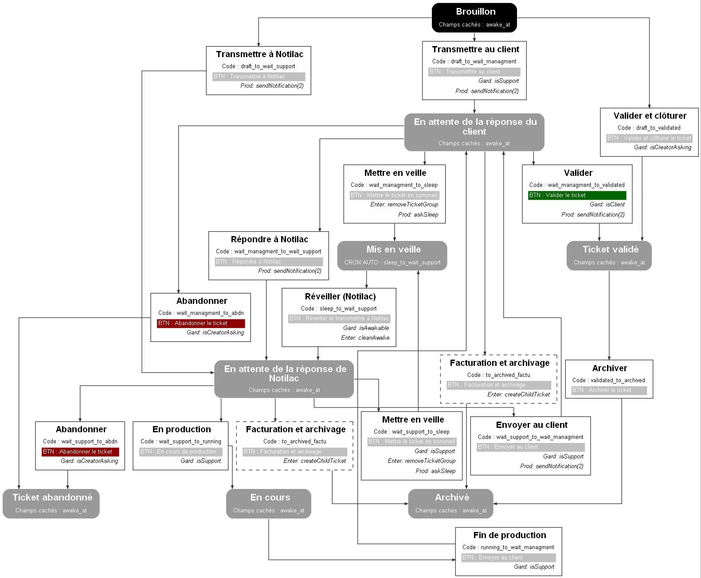

# Workflow : **ticket_w**
* type: **state_machine / single_state**
* Nom : ticket_w
* comentaire : 

## Representation graphique

##Explications graph : 
### Etat : 
* les réctangles arronds représentent les états
* CRON_AUTO : indique que des tentatives de transitions seront automatiquement effectués par l'app. 
* FORM_AUTO : indique que le formulaire va tenter d'éffectuer une transition automatique en fonction des données qu'il possède. 
* Si il y a une permission alors seul les utilisateurs avec ses permissions auront accès à l'état. 
* Si il y a une NO permission alors seul les  utilisateurs ayant une permission différente auront assès à l'état. A noter : N'écrase pas la config du controller. 

### Transitions :  
* les rectangles droits représentent les transitions 
* Un réctange de couleur avec BTN, indique qu'un bouton portant ce nom sera arriché dans le formulaire 
* il y a trois types de fonctions : 
  * Gard : Une fonction qui permet de valider ou non une transition, si la fonction retourne false, la transition ne sera pas autorisé. 
  * Trait: Une fonction de traitement qui sera executé lors de la transitions 
  * Prod: Une fonction qui va produire un élement, cette fonction est appelé après l'enregistrmeent du modèle porteur du workflow. 

## Liste des états
* **Brouillon** | code : draft
* **Retour Notilac attendu** | code : wait_support
* **Retour Client attendu** | code : wait_managment
* **En production** | code : running
* **Ticket validé** | code : validated
* **En sommeil** | code : sleep
* **Archivé** | code : archived
* **Abandon du ticket** | code : abdn

## Liste des transitions
* **Abandonner** | code : wait_support_to_abdn
    * Bouton : Abandonner le ticket
    * Liste des fonctions 
        *  isCreatorAsking | type : gard
* **Abandonner** | code : wait_managment_to_abdn
    * Bouton : Abandonner le ticket
    * Liste des fonctions 
        *  isCreatorAsking | type : gard
* **Archivage** | code : validated_to_archived
    * Bouton : Archivage du ticket
* **Archivage facturation** | code : to_archived_factu
    * Bouton : Archivage facturation
    * Liste des fonctions 
        *  createChildTicket | type : enter
* **Envoyer  client** | code : wait_support_to_wait_managment
    * Bouton : Envoyer au client
    * Liste des fonctions 
        *  isSupport | type : gard
        *  sendNotification | type : prod
            * code : waka.support::new_ticket 
            * mode : client 
* **FIN prod** | code : running_to_wait_managment
    * Bouton : Envoyer au client
    * Liste des fonctions 
        *  isSupport | type : gard
* **Mise en sommeil ** | code : wait_support_to_sleep
    * Bouton : Mise en sommeil du ticket
    * Liste des fonctions 
        *  isSupport | type : gard
        *  removeTicketGroup | type : enter
        *  askSleep | type : prod
* **Mise en sommeil ** | code : wait_managment_to_sleep
    * Bouton : Mise en sommeil du ticket
    * Liste des fonctions 
        *  removeTicketGroup | type : enter
        *  askSleep | type : prod
* **En Production** | code : wait_support_to_running
    * Bouton : En cours de production
    * Liste des fonctions 
        *  isSupport | type : gard
* **Répondre à Notilac** | code : wait_managment_to_wait_support
    * Bouton : Répondre à Notilac
    * Liste des fonctions 
        *  sendNotification | type : prod
            * code : waka.support::new_ticket 
            * mode : support 
* **Réveiller (Notilac)** | code : sleep_to_wait_support
    * Bouton : Réveiller et transmettre N
    * Liste des fonctions 
        *  isAwakable | type : gard
        *  cleanAwake | type : enter
* **Transmission Client** | code : draft_to_wait_managment
    * Bouton : Transmettre au  client
    * Liste des fonctions 
        *  isSupport | type : gard
        *  sendNotification | type : prod
            * code : waka.support::new_ticket 
            * mode : client 
* **Transmission Notilac** | code : draft_to_wait_support
    * Bouton : Transmettre à Notilac
    * Liste des fonctions 
        *  sendNotification | type : prod
            * code : waka.support::new_ticket 
            * mode : support 
* **Validation** | code : wait_managment_to_validated
    * Bouton : Valider le ticket
    * Liste des fonctions 
        *  isClient | type : gard
        *  sendNotification | type : prod
            * code : waka.support::new_ticket 
            * mode : support 
* **Valider et clôturer** | code : draft_to_validated
    * Bouton : Valider et clôturer le ticket
    * Liste des fonctions 
        *  isCreatorAsking | type : gard

## Les jeux de validations des champs
* **default**: support_client et support_user obligatoire

## Les scopes
* **running**: Tickets en cours | [draft,wait_support,wait_managment,running, validated,sleep]  
* **runningNotSleeping**:  | [draft,wait_support,wait_managment,running, validated]  
* **closed**: Tickets fermé | [archived,abdn]  

## Les executions automatiques par taches cron auront lieu par défaut à  22h30
Liste des cron auto 
* sleep: [sleep_to_wait_support]
